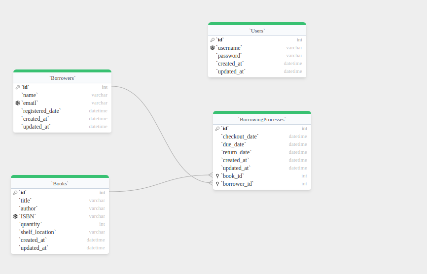

# Library Management System

## Description

This Library Management System is a RESTful API built with Node.js, Express, and Sequelize ORM. It provides functionality for managing books, borrowers, and the borrowing process in a library setting.

## Features

- Book management (add, update, delete, list, search)
- Borrower management (register, update, delete, list)
- Borrowing process (check out books, return books, view borrowed books)
- Report generation (borrowing history, overdue books)
- Authentication and authorization
- API rate limiting

## Prerequisites

- Node.js (v14 or higher)
- MySQL (v8 or higher)
- Docker and Docker Compose (for containerized setup)

## Setup and Installation


### Docker Setup

1. Make sure Docker and Docker Compose are installed on your system.

2. Clone the repository and navigate to the project directory.

3. Build and run the Docker containers:
   ```
   docker-compose up --build
   ```
you can find the server running on  `http://localhost:3000`

## API Documentation

API documentation is available via Swagger UI. After starting the server, visit:

```
http://localhost:3000/api-docs
```


## Database Schema




